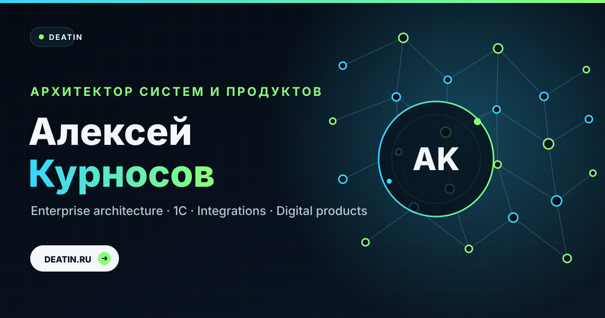
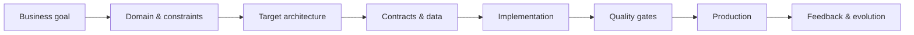
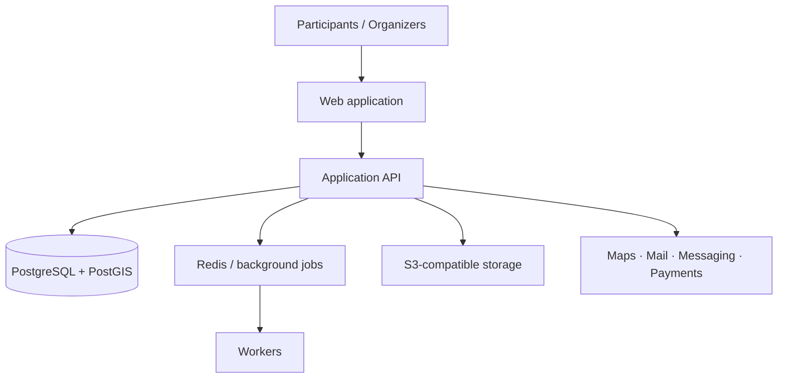

  

<h1 align="center">Алексей Курносов · Alexey Kurnosov</h1>

<strong>Enterprise / Solution Architect · 1С · Integrations · MDM · Product Founder</strong>

  Проектирую сложные корпоративные системы и цифровые продукты — от бизнес-задачи и целевой архитектуры до production.

  <a href="https://deatin.github.io/deatin/"><strong>Interactive portfolio ↗</strong></a>
  &nbsp;·&nbsp;
  <a href="https://trassami.ru/"><strong>Trassami ↗</strong></a>
  &nbsp;·&nbsp;
  <a href="mailto:i@deatin.ru"><strong>i@deatin.ru</strong></a>

---

## What I do

Я работаю на пересечении **enterprise-архитектуры, интеграций, мастер-данных и product engineering**. Моя задача — не просто нарисовать целевую схему, а довести решение до состояния, в котором оно понятно бизнесу, реализуемо командой и устойчиво работает в production.

| Направление | Фокус |
|---|---|
| **Enterprise Architecture** | целевые модели, границы систем, roadmap, архитектурные решения, риски и компромиссы |
| **1С Architecture** | 1С:ERP, 1С:УХ, 1С:Документооборот, интеграционные и функциональные контуры |
| **Integration Architecture** | REST, SOAP, event-driven, Kafka, RabbitMQ, API contracts, observability |
| **Data / MDM** | мастер-данные, канонические модели, подписки, идентификаторы, качество данных |
| **Product Engineering** | discovery, UX, backend/API, payments, security, CI/CD, release management |
| **Delivery** | от требований и ADR до quality gates, приёмки и production rollout |

### Core stack

`1С:ERP` · `1С:УХ` · `MDM` · `REST` · `SOAP` · `Kafka` · `RabbitMQ` · `PostgreSQL` · `PostGIS` · `Redis` · `NestJS` · `Docker` · `DDD` · `CI/CD`

---

## Selected architecture cases

<table>
<tr>
<td width="33%" valign="top">

### 🟢 Trassami
**Event-tech platform · Founder project**

Платформа спортивных мероприятий и маршрутов: события, регистрации, маршруты, календарь, уведомления, приватность и операционный контур организатора.

**Architecture:** SPA · NestJS · PostgreSQL/PostGIS · Redis/BullMQ · S3 · edge/TLS · external providers.

[**Architecture case →**](showcase/trassami-architecture/README.md)

</td>
<td width="33%" valign="top">

### 🔵 Enterprise MDM
**Master Data Architecture**

Анонимизированный кейс построения единого контура мастер-данных: источник истины, подписки, идентификаторы, валидация и интеграция корпоративных систем.

**Focus:** governance · contracts · lifecycle · data quality · integration boundaries.

[**Architecture case →**](showcase/enterprise-mdm/README.md)

</td>
<td width="33%" valign="top">

### 🟣 ERP ↔ MES ↔ OT
**Industrial Integration**

Анонимизированный кейс интеграции корпоративного и производственного контура: ERP, MES и уровень АСУ ТП/OT.

**Focus:** production data flow · balances · traceability · system ownership · resilient integration.

[**Architecture case →**](showcase/industrial-integration/README.md)

</td>
</tr>
</table>

---

## Architecture mindset

**Принципы, которыми я пользуюсь:**

- **Clarity over complexity** — архитектура должна уменьшать сложность, а не документировать её.
- **Explicit ownership** — у данных, API, процессов и решений должны быть понятные владельцы.
- **Contracts before coupling** — интеграция начинается с контракта и жизненного цикла данных.
- **Security by design** — безопасность и приватность являются частью архитектуры, а не последним этапом.
- **Production is the finish line** — решение считается завершённым, когда оно воспроизводимо, наблюдаемо и управляемо в production.

---

## Current product: Trassami

Я развиваю **[Trassami](https://trassami.ru/)** — спортивную event-tech платформу. В продукте соединяются пользовательские сценарии, геоданные, регистрации, коммуникации, организационные процессы и платёжная инфраструктура.

Публичный архитектурный разбор без приватного кода: **[showcase/trassami-architecture](showcase/trassami-architecture/README.md)**.

---

## How I work

**Understand → Design → Deliver → Verify → Operate**

1. Формулирую реальную бизнес-задачу и критерии успеха.
2. Фиксирую контекст, ограничения и системные границы.
3. Проектирую целевую архитектуру и контракты.
4. Разбиваю переход на реализуемые этапы и контролируемые риски.
5. Сопровождаю реализацию через reviews, tests и quality gates.
6. Проверяю production-readiness и управляемость решения после запуска.

---

## Contact

**Санкт-Петербург · Remote**

- Portfolio: **https://deatin.github.io/deatin/**
- Product: **https://trassami.ru/**
- Email: **i@deatin.ru**

Architecture · Integrations · Data · Products

