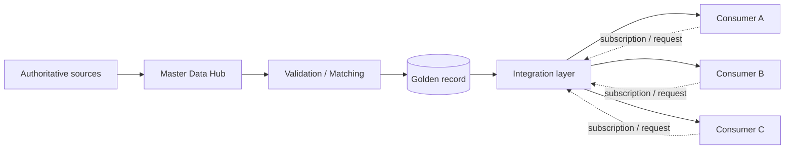
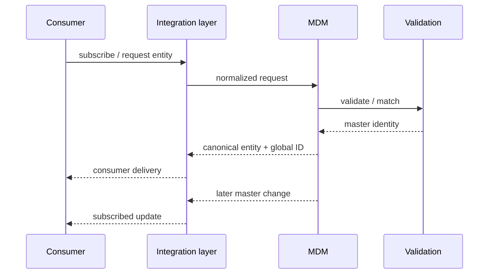
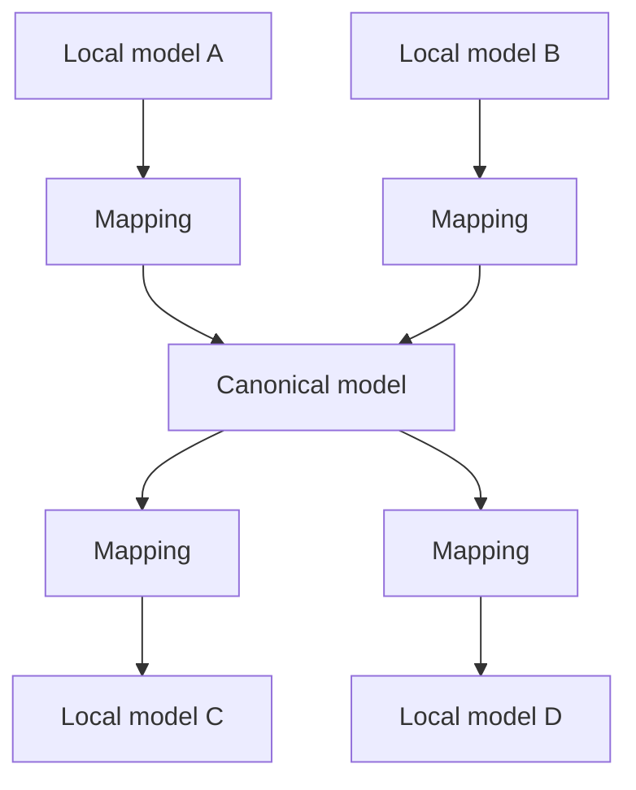
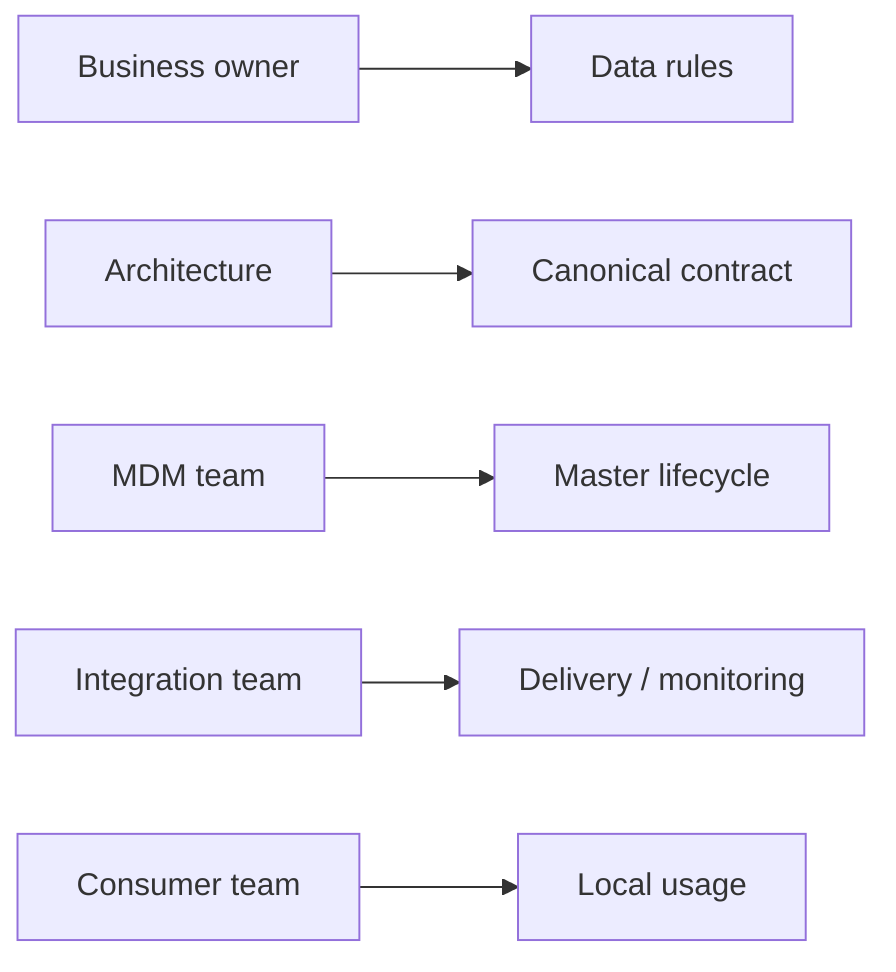
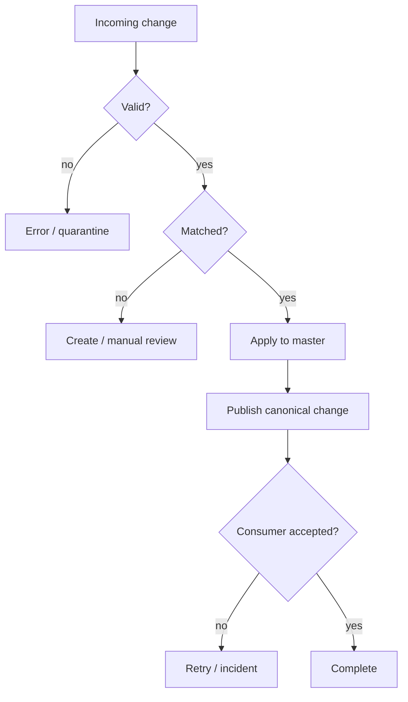

# Enterprise MDM — anonymized architecture case

> **Master Data Management · Enterprise integration · Governance**  
> Анонимизированный архитектурный кейс. Названия заказчика, внутренних систем и закрытые интерфейсы не публикуются.

[← Back to profile](../../README.md)

---

## 1. Problem

В крупном корпоративном ландшафте один и тот же бизнес-объект может существовать сразу в нескольких системах. Без единого master-процесса появляются дубли, расхождение атрибутов, локальные справочники и сложные point-to-point интеграции.

Архитектурная цель — построить контур, в котором:

- существует **понятный источник истины**;
- потребители получают только разрешённые мастер-данные;
- идентификаторы и lifecycle объекта единообразны;
- подписка и доставка изменений контролируются;
- ошибки и дубли можно проследить до источника;
- локальное редактирование не разрушает master ownership.

---

## 2. Target model

Главная идея: **master ownership отделён от distribution ownership**. Система, которая является владельцем эталонного объекта, не обязана напрямую знать обо всех потребителях.

---

## 3. Core concepts

| Concept | Architectural meaning |
|---|---|
| **Master / golden record** | каноническая версия сущности |
| **Global identifier** | стабильный идентификатор между системами |
| **Subscription** | явное право/намерение потребителя получать объект и изменения |
| **Matching / duplicate control** | правила сопоставления и предотвращения дублей |
| **Lifecycle state** | active / inactive / merged / blocked и другие управляемые состояния |
| **Canonical contract** | единый формат обмена, независимый от локальных схем потребителей |

---

## 4. Data flow

Критично разделять:

- запрос на получение сущности;
- создание/изменение мастер-объекта;
- подписку на дальнейшие изменения;
- техническую доставку сообщения.

Иначе транспортный слой начинает определять бизнес-lifecycle.

---

## 5. Canonical contract

Преимущества canonical model:

- меньше связей N×N;
- контролируемая эволюция контрактов;
- явная семантика атрибутов;
- единое место для validation rules;
- проще impact analysis при изменениях.

---

## 6. Ownership & governance

Хорошая MDM-архитектура требует не только API, но и организационных договорённостей:

- кто владеет атрибутом;
- кто подтверждает изменение;
- кто отвечает за duplicate resolution;
- кто принимает решение о деактивации;
- что считается authoritative source;
- как изменяется контракт без поломки потребителей.

---

## 7. Failure model

Ошибки не должны превращаться в «потерянные сообщения». Нужны наблюдаемые состояния, correlation ID, повторная доставка и понятный процесс ручного разбора.

---

## 8. Architecture decisions

| Decision | Why |
|---|---|
| **One authoritative master per entity/attribute** | исключение конкурирующего владения |
| **Global identifier** | стабильная связь между системами |
| **Canonical contracts** | снижение point-to-point coupling |
| **Explicit subscription** | контролируемое распространение данных |
| **No uncontrolled local mastering** | защита качества master data |
| **Traceable errors** | возможность операционного восстановления |

---

## 9. What this case demonstrates

- проектирование **enterprise data ownership**;
- разделение master, integration и consumer responsibilities;
- работа с contract-first интеграциями;
- lifecycle и duplicate management;
- архитектурная документация, test scenarios и governance;
- баланс между централизованным MDM и реальными ограничениями существующих систем.

> The case is intentionally anonymized and omits customer names, internal endpoints, message schemas and operational credentials.
