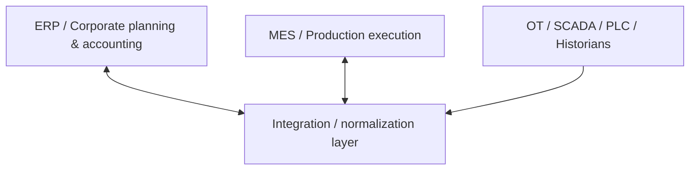
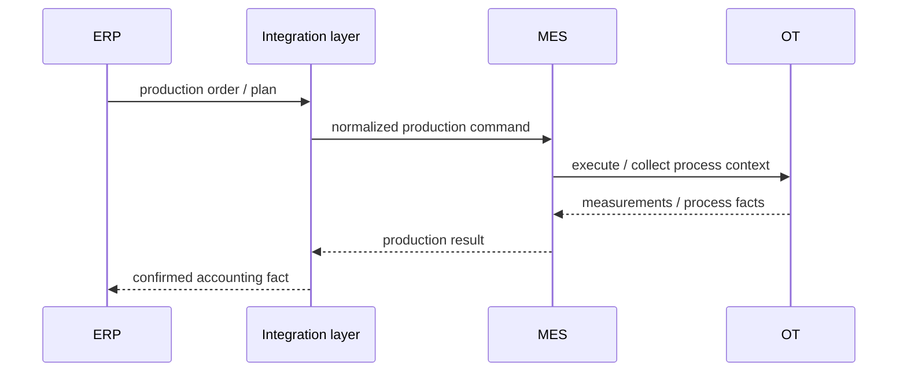
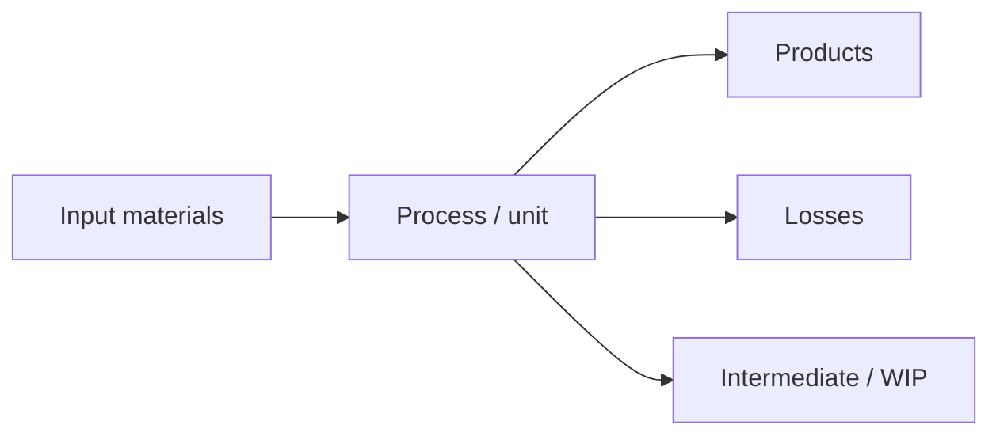
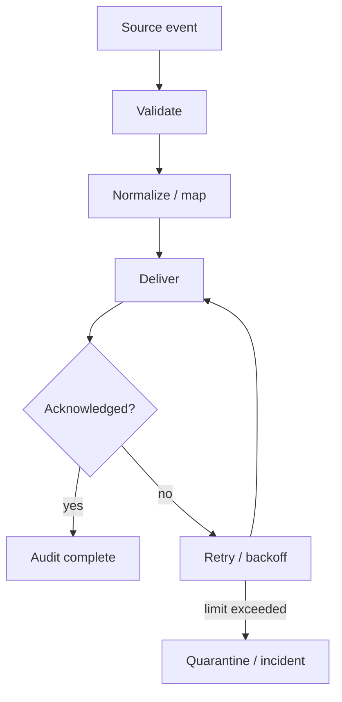
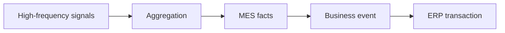

# ERP ↔ MES ↔ OT — anonymized industrial integration case

> **Industrial Integration · Production data · Traceability**  
> Анонимизированный архитектурный кейс. Названия предприятий, внутренних систем, сетевых сегментов и закрытые интерфейсы не публикуются.

[← Back to profile](../../README.md)

---

## 1. Context

Производственный контур и корпоративный ERP живут в разных временных масштабах и решают разные задачи.

- **ERP** оперирует заказами, партиями, материалами, себестоимостью и учётными событиями.
- **MES** управляет производственным исполнением, операциями и фактом выпуска.
- **OT / АСУ ТП** формирует технологические сигналы, измерения и фактическое состояние оборудования/процесса.

Архитектурная задача — связать эти уровни так, чтобы данные были **сопоставимы, прослеживаемы и пригодны для производственного баланса**, не превращая ERP в realtime-систему и не перенося бизнес-логику в PLC/SCADA-уровень.

---

## 2. Layered model



Ключевой принцип: **каждый слой сохраняет собственную ответственность**.

- ERP не должен интерпретировать сырые технологические сигналы;
- OT не должен знать о бухгалтерской модели;
- MES связывает производственные операции с планом и фактом;
- integration layer нормализует события и обеспечивает трассировку.

---

## 3. Data ownership

| Data | System of record |
|---|---|
| производственный заказ | ERP |
| маршрут/операция исполнения | MES |
| измерения и технологический факт | OT / historian |
| агрегированный производственный факт | MES / integration layer |
| учётный выпуск / движение | ERP |

Ошибки в ownership быстро приводят к двойному вводу и конфликтующим фактам, поэтому владение фиксируется до проектирования API.

---

## 4. Production event flow



Integration layer отвечает за:

- преобразование форматов;
- correlation между планом и фактом;
- контроль повторной доставки;
- дедупликацию;
- audit trail;
- управляемую обработку ошибок.

---

## 5. Balance model

Для непрерывного/передельного производства особенно важно не просто передать «выпуск», а обеспечить производственный баланс.



Упрощённая проверка:

`Input = Output + WIP change + Losses ± measurement tolerance`

Архитектура должна позволять объяснить расхождение, а не только сохранить итоговое число.

---

## 6. Event contract

Хорошее промышленное событие содержит не только payload, но и контекст:

```text
EventId
EventType
OccurredAt
SourceSystem
ProductionOrderId
OperationId
Material / Product identity
Quantity + Unit
Equipment / Unit context
CorrelationId
SchemaVersion
```

Это позволяет строить трассировку от ERP-документа до MES-операции и технологического факта.

---

## 7. Reliability model



В production integration нельзя считать HTTP 200 достаточным доказательством бизнес-успеха. Нужны:

- technical acknowledgement;
- business acknowledgement;
- idempotency;
- retry policy;
- dead-letter/quarantine process;
- observability по correlation ID.

---

## 8. Temporal decoupling

ERP обычно работает транзакционно и относительно медленно, OT — почти realtime. Поэтому между ними нельзя строить наивный synchronous request chain.



Сырые сигналы агрегируются до бизнес-событий, пригодных для MES/ERP.

---

## 9. Architecture decisions

| Decision | Why |
|---|---|
| **Layered ownership** | каждый уровень решает свою задачу |
| **Business events instead of raw signals** | ERP не перегружается realtime telemetry |
| **Correlation IDs** | end-to-end traceability |
| **Idempotent delivery** | защита от дублей при retries |
| **Explicit balance model** | объяснимость производственных расхождений |
| **Versioned contracts** | безопасная эволюция интеграции |

---

## 10. What this case demonstrates

- архитектура интеграции между **ERP, MES и OT**;
- понимание различий realtime и transactional domains;
- contract-first подход;
- производственные балансы и traceability;
- устойчивость интеграции к повторам, задержкам и частичным отказам;
- перевод технологического факта в бизнес-событие.

> This public case intentionally omits customer identity, topology, internal protocols, hostnames and security-sensitive implementation details.
