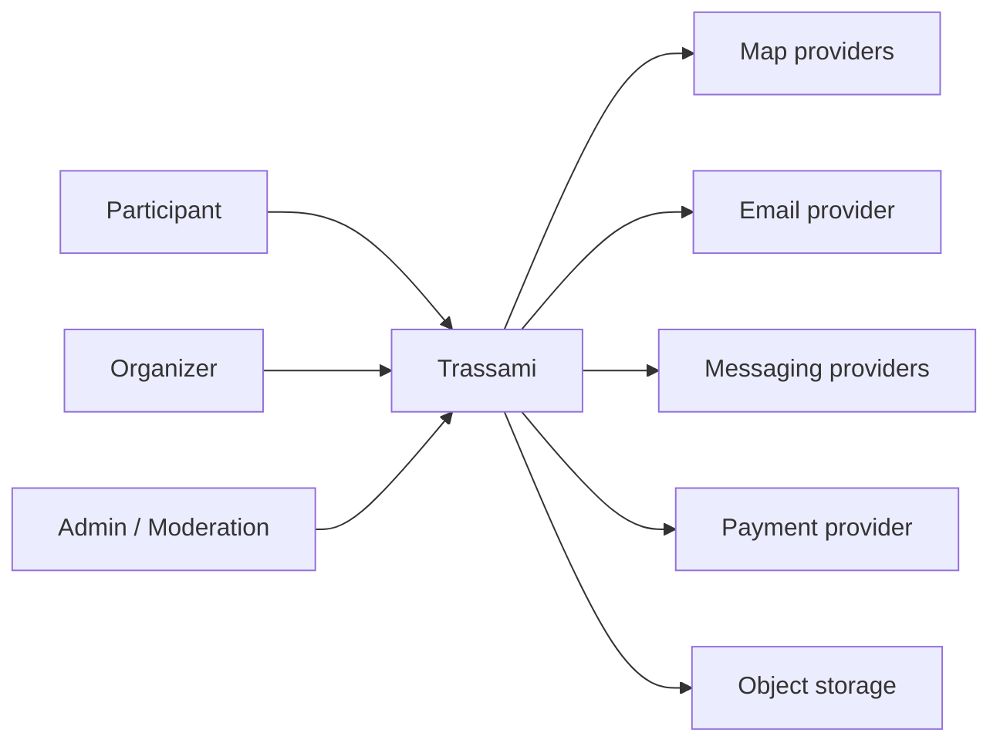
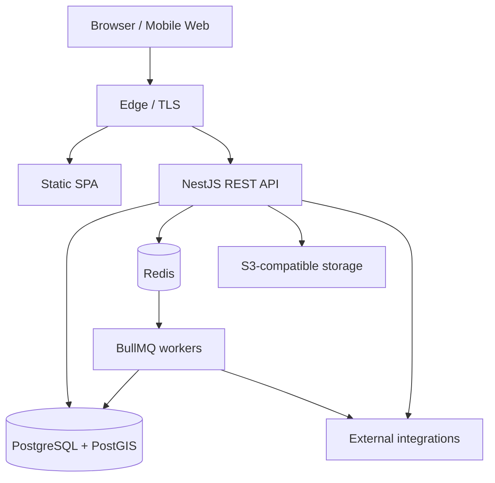
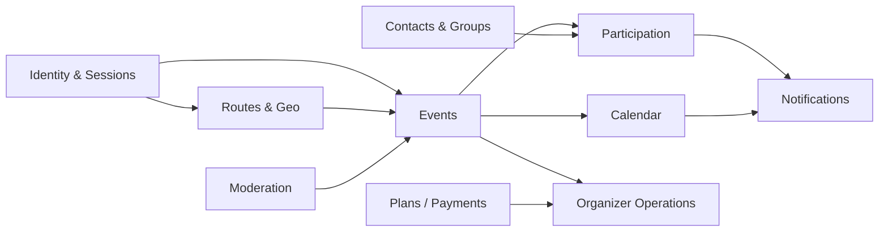
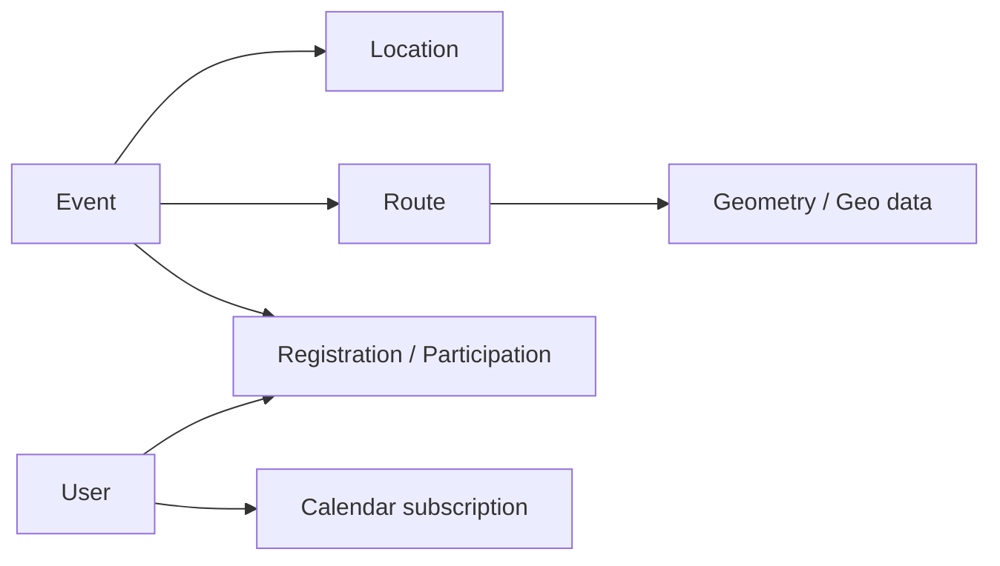
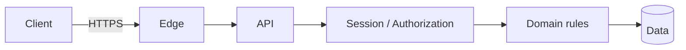
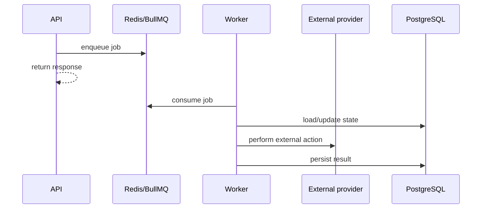
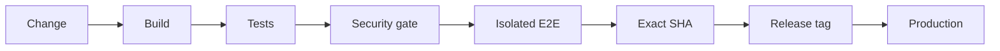

# Trassami — public architecture case

> **Event-tech platform · Founder project · Production system**  
> Public architecture overview. Private source code, infrastructure identifiers, credentials and operational secrets are intentionally excluded.

[← Back to profile](../../README.md) · [Open Trassami ↗](https://trassami.ru/)

---

## 1. Product context

**Trassami** — платформа спортивных мероприятий и маршрутов. Она объединяет пользовательский каталог, геоданные, регистрацию и участие, календарные сценарии, уведомления, приватность, группы и операционные инструменты организатора.

Архитектурная задача — поддержать одновременно несколько разных режимов работы:

- публичный discovery мероприятий и маршрутов;
- персональные и приватные сценарии;
- создание и управление событиями организатором;
- участие, заявки, подтверждения и лист ожидания;
- геоданные и файлы маршрутов;
- фоновые уведомления и календарные подписки;
- внешние провайдеры карт, почты, сообщений и платежей;
- безопасный production delivery с воспроизводимыми quality gates.

---

## 2. System context

Главный принцип: **внешние провайдеры не должны определять внутреннюю доменную модель продукта**. Интеграции изолируются контрактами и адаптерами, чтобы критические сценарии не зависели от одного vendor API.

---

## 3. Container view

### Core components

| Component | Responsibility |
|---|---|
| **SPA frontend** | пользовательские сценарии, каталог, карты, кабинеты участника и организатора |
| **NestJS API** | бизнес-правила, authorization, orchestration, contracts |
| **PostgreSQL + PostGIS** | транзакционные данные и геопространственная модель |
| **Redis + BullMQ** | очереди, фоновые задачи, отложенная обработка |
| **S3-compatible storage** | изображения, документы, файлы маршрутов |
| **Edge / TLS** | HTTPS termination и маршрутизация трафика |
| **External adapters** | карты, email, messaging, payments и другие provider boundaries |

---

## 4. Domain decomposition

Домены разделяются не ради количества модулей, а чтобы **локализовать правила и снизить связанность**. Например, lifecycle участия не должен быть размазан по UI, уведомлениям и событию — у него есть собственные состояния и переходы.

---

## 5. Data architecture

### Transactional + geospatial model

PostgreSQL используется как основное транзакционное хранилище. **PostGIS** позволяет держать географию маршрутов и событий рядом с бизнес-данными, сохраняя консистентную модель и возможность пространственных запросов.

Ключевые архитектурные правила:

- идентификаторы стабильны и не зависят от UI;
- приватность — часть модели доступа, а не только фильтр отображения;
- геоданные имеют явный lifecycle;
- внешние provider IDs не становятся внутренними primary keys;
- фоновые операции проектируются идемпотентно там, где возможен retry.

---

## 6. Security & privacy boundaries

Security рассматривается как системное свойство.

Основные меры на архитектурном уровне:

- подтверждение email для регистрации;
- refresh-сессии в **HttpOnly cookie**;
- server-side authorization для защищённых ресурсов;
- публичный / приватный / групповой доступ как явные состояния;
- раздельные конфигурации окружений и секретов;
- валидация загрузок и контроль storage boundary;
- security checks как часть delivery pipeline.

---

## 7. Async processing

Не всё должно выполняться в HTTP request path. Уведомления, повторяемые операции и тяжёлые фоновые задачи выносятся в очередь.

Это уменьшает latency пользовательского запроса и создаёт контролируемое место для retries, backoff и observability.

---

## 8. Delivery model

Production выпускается только из **точного проверенного commit/tag**. Между кодом и deployment существует воспроизводимая цепочка проверок.

Цель такой модели — исключить ситуацию, когда проверялся один набор исходников, а в production оказался другой.

---

## 9. Architecture decisions

| Decision | Why |
|---|---|
| **PostgreSQL + PostGIS** | единый transactional/geospatial source of truth |
| **Redis + BullMQ** | контролируемая асинхронность и retries |
| **Provider adapters** | снижение vendor lock-in и защита доменной модели |
| **Static SPA + API boundary** | независимое развитие presentation и application layers |
| **Exact-SHA release discipline** | воспроизводимость production deployment |
| **Privacy in domain rules** | исключение privacy-by-frontend ошибок |

---

## 10. What this case demonstrates

Этот проект показывает мою работу сразу в нескольких ролях:

- **Product founder** — формирование сценариев и приоритетов;
- **Solution architect** — системные границы, данные и интеграции;
- **Integration architect** — provider contracts и async boundaries;
- **Delivery owner** — quality gates и production readiness;
- **Security-minded architect** — privacy и authorization в доменной модели.

---

### Public links

- **Product:** https://trassami.ru/
- **Portfolio:** https://deatin.github.io/deatin/
- **GitHub profile:** https://github.com/DEATIN

> This document is intentionally architecture-focused. It does not publish private source code, internal hostnames, credentials, production topology details or security-sensitive runbooks.
